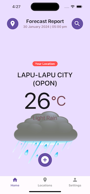
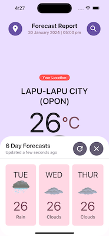
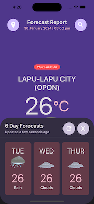
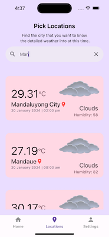
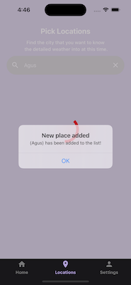

# Weather App in React Native

React Native Training Assessment Project

## Screenshots

	
	
	
	
	
	

	
	
	
	
	
	
	
	
	
	

	
	

## Functionality

1. Get weather forecast to any location
1. Get weather location of current location
1. Switching Celsius to Fahrenheit temperature unit
1. Persistent data to allow display offline data
1. Delete persisted data
1. Dark and Light theme mode

## Extras

### HomeScreen

* Your Location indicator
* API Activity Indicator

### LocationsScreen

* Your Location indicator
* Displayed from home indicator
* API Activity Indicator
* Filtered locations using search key
* Pull to refresh
* Location list sorting 

## Expo App Initialization

	% ls
	rn-weather 	done-with-it
	
	$ npx create-expo-app rn-weather
	✔ Downloaded and extracted project files.
	...
	✅ Your project is ready!

## Running the app locally

	$ cd rn-weather
	
	$ npm install
	$ npx expo start
	Starting Metro Bunder
	
NOTE: **IGNORE** these folders `node_modules`, `ios`, `android` to the versioning files

## Expo Library Installation

	$ npx pod-install
	$ npx expo install expo-localization
	
## NPM Library Installation

	$ npm list
	$ npm i react-native-gesture-handler
	$ npm uninstall --save-dev react-native-gesture-handler
	
## Snippets

* **rnfc** - Function Component

## Libraries and APIs

1. [Expo SDK](https://docs.expo.dev/versions/latest/) - provides access to device and system functionality such as contacts, camera, gyroscope, GPS location, and so on, in the form of packages
	* [Expo Location](https://docs.expo.dev/versions/latest/sdk/location/) - provides access to reading geolocation information, polling current location from the device
	* [Expo Network](https://docs.expo.dev/versions/latest/sdk/network/) - provides access to the device's network [sample link](https://stackoverflow.com/questions/56669908/how-to-check-for-an-internet-connection-in-an-expo-react-native-app)
	* [Expo Localization](https://docs.expo.dev/versions/v49.0.0/sdk/localization/) - provides an interface for native user localization information

1. NPM Javascripts
	* [Bottom Sheet](https://www.npmjs.com/package/react-native-raw-bottom-sheet)
	* [NetInfo](https://www.npmjs.com/package/@react-native-community/netinfo)
	* [React Native Logs](https://www.npmjs.com/package/react-native-logs)
	* [React Native UUID](https://www.npmjs.com/package/react-native-uuid)
	* [React i18Next](https://dev.to/adrai/how-to-properly-internationalize-a-react-application-using-i18next-3hdb) - internationalize a react application.
		* [Documentation](https://www.i18next.com/)
		* [Video Tutorial](https://www.youtube.com/watch?v=3BPM_M4gGso)
		* [RNLanguageDetector](https://www.npmjs.com/package/@os-team/i18next-react-native-language-detector) - detect user's language
		* [React Native Project (Github)](https://github.com/i18next/react-i18next/blob/master/example/ReactNativeProject/i18n.js)

1.  [React Native Paper](https://callstack.github.io/react-native-paper/) - Cross-platform Material Design for React Native
	* [Guides](https://callstack.github.io/react-native-paper/docs/guides/getting-started) 
	* [Components](https://callstack.github.io/react-native-paper/docs/components/ActivityIndicator)

1. [React Native Vector Icons Directory](https://static.enapter.com/rn/icons/material-community.html) - ready to use icons
1. Redux + [Redux-Persist](https://github.com/rt2zz/redux-persist) - predictable state container
1. [Apisauce](https://github.com/infinitered/apisauce) - api integration
1. [Moment](https://momentjs.com/) - display dates and time
1. [React Native Dot Env](https://github.com/goatandsheep/react-native-dotenv) - environment variables
1. [React Navigation](https://reactnavigation.org/docs/getting-started/) - routing and navigation for Expo and React Native apps

1. [Open Weather Map API](https://openweathermap.org/api)
	* [5 day Weather Forecast API](https://openweathermap.org/forecast5) - 5 day forecast is available at any location on the globe
	* [Weather Conditions](https://openweathermap.org/weather-conditions)

## References

1. [Mockup](https://drive.google.com/file/d/1nqEok0x72d8Ola5aDA9VBigrCqwJesd0/view?usp=sharing) - UI design in wireframes

## Tutorials

1. **Redux** - state management library

	* [React Redux Tutorials by Codevolution](https://www.youtube.com/playlist?list=PLC3y8-rFHvwheJHvseC3I0HuYI2f46oAK)
	* [Mastering Redux in React Native Expo: A Comprehensive Tutorial](https://www.youtube.com/watch?v=F3lE189w4r8)

1. [Dynamic Switching of Themes](https://medium.com/@SeishinBG/dynamic-switching-of-themes-in-react-native-app-the-funky-way-with-hooks-48b57ab62a79)	

1. [How to persist the shopping cart state to local storage](https://www.youtube.com/watch?v=shLz_kmA68Q)

1. React Native MVVM **(future implementations)**

	* [React Native MVVM Concept](https://tech.groww.in/apply-mvvm-in-react-native-app-ad77fa0f851b)
	* [React Native MVVM Demo (Github)](https://github.com/kushal98/rn-mvvm-demo/tree/master/src) - MVVM architecture design pattern sample