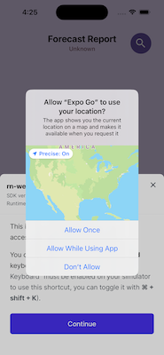
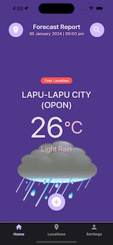

# Weather App in React Native

React Native Training Assessment Project

## Screenshots

	
	
	
	
	
	

	
	
	
	
	

	
	

## Expo App Initialization

	% ls
	rn-weather 	done-with-it
	
	$ npx create-expo-app rn-weather
	✔ Downloaded and extracted project files.
	...
	✅ Your project is ready!

## Running the app locally

	$ cd rn-weather
	
	$ npx expo start
	Starting Metro Bunder

## NPM Library Installation

	$ npm list
	$ npm i react-native-gesture-handler
	$ npm uninstall --save-dev react-native-gesture-handler
	
## Snippets

* **rnfc** - Function Component

## Libraries

1. [Expo SDK](https://docs.expo.dev/versions/latest/) - provides access to device and system functionality such as contacts, camera, gyroscope, GPS location, and so on, in the form of packages
	* [Expo Location](https://docs.expo.dev/versions/latest/sdk/location/) - provides access to reading geolocation information, polling current location from the device
	* [Expo Network](https://docs.expo.dev/versions/latest/sdk/network/) - provides access to the device's network
	* [Expo Network Sample](https://stackoverflow.com/questions/56669908/how-to-check-for-an-internet-connection-in-an-expo-react-native-app)
1.  [React Native Paper](https://callstack.github.io/react-native-paper/) - Cross-platform Material Design for React Native
	* [Guides](https://callstack.github.io/react-native-paper/docs/guides/getting-started) 
	* [Components](https://callstack.github.io/react-native-paper/docs/components/ActivityIndicator)
1. [Bottom Sheet](https://www.npmjs.com/package/react-native-raw-bottom-sheet)
1. Redux + [Redux-Persist](https://github.com/rt2zz/redux-persist) - predictable state container
1. [Apisauce](https://github.com/infinitered/apisauce)
1. [React Native Logs](https://www.npmjs.com/package/react-native-logs)
1. [Moment](https://momentjs.com/) - display dates and time
1. [React Native Dot Env](https://github.com/goatandsheep/react-native-dotenv) - environment variables
1. [React Native UUID](https://www.npmjs.com/package/react-native-uuid)
1. [React Navigation](https://reactnavigation.org/docs/getting-started/)

## References

1. React Native MVVM

	* [React Native MVVM Concept](https://tech.groww.in/apply-mvvm-in-react-native-app-ad77fa0f851b)
	* [React Native MVVM Demo](https://github.com/kushal98/rn-mvvm-demo/tree/master/src) - MVVM architecture design pattern sample
	
1. [Mockup](https://drive.google.com/file/d/1nqEok0x72d8Ola5aDA9VBigrCqwJesd0/view?usp=sharing)

## Tutorials

1. **Redux** - state management library

	* [React Redux Tutorials by Codevolution](https://www.youtube.com/playlist?list=PLC3y8-rFHvwheJHvseC3I0HuYI2f46oAK)
	* [Mastering Redux in React Native Expo: A Comprehensive Tutorial](https://www.youtube.com/watch?v=F3lE189w4r8)

1. [Dynamic Switching of Themes](https://medium.com/@SeishinBG/dynamic-switching-of-themes-in-react-native-app-the-funky-way-with-hooks-48b57ab62a79)	

1. [How to persist the shopping cart state to local storage](https://www.youtube.com/watch?v=shLz_kmA68Q)